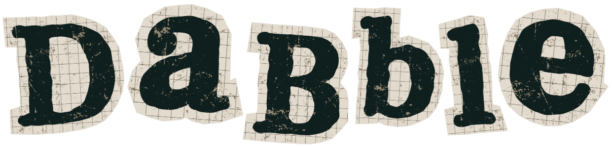

<a name="readme-top">

<br/>

<br />
<div align="center">
  <a href="https://github.com/zyx-0314/">
  <!-- TODO: If you want to add logo or banner you can add it here -->
    
  </a>
<!-- TODO: Change Title to the name of the title of your Project -->
  <h3 align="center">DaBble</h3>
</div>
<!-- TODO: Make a short description -->
<div align="center">
  The aBility to experience different lives.
</div>

<br />

<!-- TODO: Change the zyx-0314 into your github username  -->
<!-- TODO: Change the WD-Template-Project into the same name of your folder -->


[](https://wakatime.com/badge/user/ac75069c-0026-4e12-ace1-bf89d540faf8/project/88afe829-e1dd-4510-b234-5d8e726eed03)

---

<br />
<br />

<!-- TODO: If you want to add more layers for your readme -->
<details>
  <summary>Table of Contents</summary>
  <ol>
    <li>
      <a href="#overview">Overview</a>
      <ol>
        <li>
          <a href="#key-components">Key Components</a>
        </li>
        <li>
          <a href="#technology">Technology</a>
        </li>
      </ol>
    </li>
    <li>
      <a href="#rule,-practices-and-principles">Rules, Practices and Principles</a>
    </li>
    <li>
      <a href="#resources">Resources</a>
    </li>
  </ol>
</details>

---

## Overview

<!-- TODO: To be changed -->
<!-- The following are just sample -->

DaBble is a digital library where I’ve gathered and showcased one of my all-time favorite books. DaBble is all about exploring literature in different genres from horror to romance and other ways to stir your emotions, shaped your thinking and spark your curiosity in every chapter.

DaBble is designed to let you feel something real—one page at a time.

### Key Components

<!-- TODO: List of Key Components -->
<!-- The following are just sample -->

- Personal library
- Book discover tool
- All time favorite readings

### Technology

<!-- TODO: List of Technology Used -->
#### Language


## Rules, Practices and Principles

<!-- Do not Change this -->

1. Always use `AD-` in the front of the Title of the Project for the Subject followed by your custom naming.
2. Do not rename `.php` files if they are pages; always use `index.php` as the filename.
3. Add `.component` to the `.php` files if they are components code; example: `footer.component.php`.
4. Add `.util` to the `.php` files if they are utility codes; example: `account.util.php`.
5. Place Files in their respective folders.
6. Different file naming Cases
   | Naming Case | Type of code         | Example                           |
   | ----------- | -------------------- | --------------------------------- |
   | Pascal      | Utility              | Accoun.util.php                   |
   | Camel       | Components and Pages | index.php or footer.component.php |
8. Renaming of Pages folder names are a must, and relates to what it is doing or data it holding.
9. Use proper label in your github commits: `feat`, `fix`, `refactor` and `docs`
10. File Structure to follow below.

```
AD-ProjectName
└─ assets
|   └─ css
|   |   └─ name.css
|   └─ img
|   |   └─ name.jpeg/.jpg/.webp/.png
|   └─ js
|       └─ name.js
└─ components
|   └─ name.component.php
|   └─ templates
|      └─ name.component.php
└─ handlers
|   └─ name.handler.php
└─ pages
|  └─ pageName
|     └─ assets
|     |  └─ css
|     |  |  └─ name.css
|     |  └─ img
|     |  |  └─ name.jpeg/.jpg/.webp/.png
|     |  └─ js
|     |     └─ name.js
|     └─ index.php
└─ utils
|   └─ name.utils.php
└─ vendor
└─ .gitignore
└─ bootstrap.php
└─ composer.json
└─ composer.lock
└─ index.php
└─ readme.md
└─ router.php
```
> The following should be renamed: name.css, name.js, name.jpeg/.jpg/.webp/.png, name.component.php(but not the part of the `component.php`), Name.utils.php(but not the part of the `utils.php`)

## Resources

<!-- TODO: Add References -->

| Title        | Purpose                                                                       | Link          |
| ------------ | ----------------------------------------------------------------------------- | ------------- |
| Sample Title | Sample purpose would be here like this and this is the example of what it is. | trykolang.com |
| Sample Title | Sample purpose would be here like this and this is the example of what it is. | trykolang.com |
| Sample Title | Sample purpose would be here like this and this is the example of what it is. | trykolang.com |
| Sample Title | Sample purpose would be here like this and this is the example of what it is. | trykolang.com |
